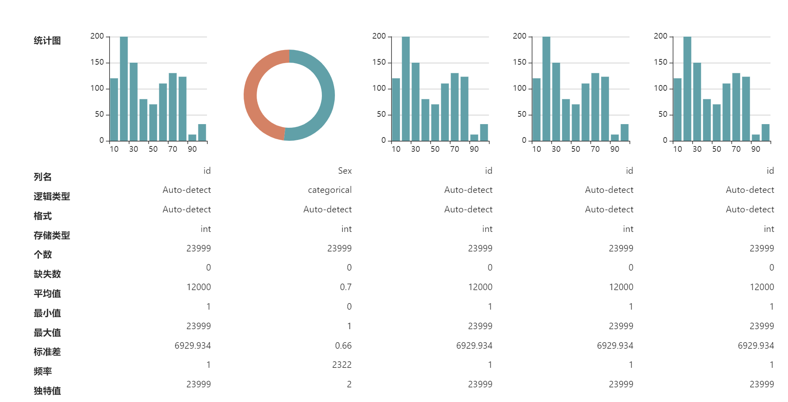

# ReverseTable
ReverseTable,  a Table that displays data in a horizontal way. 

For example, a table like the following picture




## API

Usage is similar to ant-design's `Table` Component.


ReverseTable

| Props      | Description                    | Type             | Default Value |
| ---------- | ------------------------------ | ---------------- | ------------- |
| columns    | columns configuration of table | Array of Objects | ---           |
| dataSource | Data record to be displayed    | Array of Objects | ---           |

Column Configuration

| Parameters | Description                                                  | Type     |
| ---------- | ------------------------------------------------------------ | -------- |
| title      | the title of column                                          | String   |
| dataIndex  | Display field of the data record                             | String   |
| render     | Renderer of the table cell. The return value should be a ReactNode | Function |
| style      | the CSS style of the table cell                              | Object   |

Column example

```Js
  const columns = [
    {
      dataIndex: 'chart',
      title: 'Bar Charts',
      render(record) {
        return (
          <BarCharts column={record}></BarCharts>  // self defined components
        );
      },
      style: {
        marginTop: 180 // Camel-Case
      }
    },
    {
      dataIndex: 'id',
      title: 'ID',
    },
    {
      dataIndex: 'sex',
      title: 'Sex',
    },
  ]
  
  const data = [
      {
          graph:{},
          id: 1,
          sex: 'male'
      }
  ]
  
  <ReverseTable columns={columns} dataSource={data}></ReverseTable>
```


