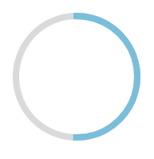
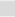

# RingProgress 环形进度条

## UI



## API

| props           | Description                               | Type               | Default Value                                                |
| --------------- | ----------------------------------------- | ------------------ | ------------------------------------------------------------ |
| width           | width of the ring ('px' as unit)          | Number             | 100                                                          |
| radius          | thickness of the ring (px as unit)        | Number             | 5                                                            |
| progress        | percentage of filled parts(range: [0,1]). | Number             | 0                                                            |
| backgroundColor | Color of the unfilled parts               | String (hex color) |  #dadada, light gray |
| barColor        | Color of the progress bar                 | String(hex color)  |  \#79BEDB  light blue |


## How it works

The ring is based on `svg`.  Two circles are involved, one for the background and the other for the bar.  The ring is dashed into parts by the [`strokeDasharray`props](https://css-tricks.com/almanac/properties/s/stroke-dasharray/), and the length of the ring bar is controlled by the `strokeDashoffset` props of the `circle` element.  


## Example

```js
<RingProgress progress={0.8}></RingProgress>
```

